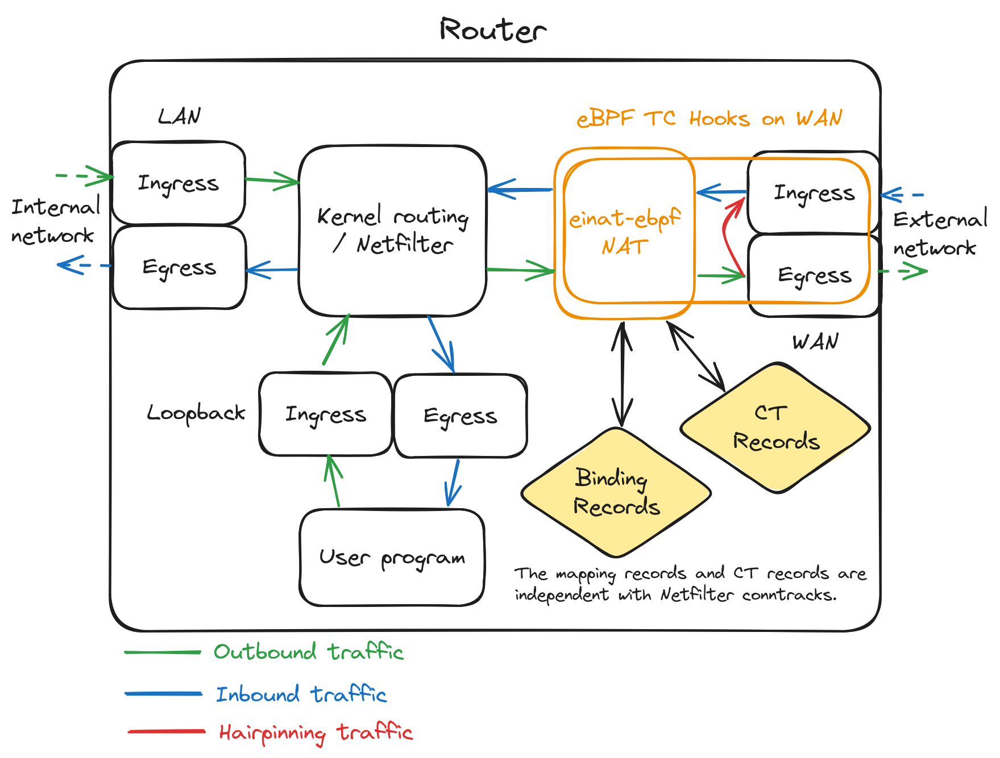

# Packet Flow

The diagram below briefly shows how `einat` works.

## NAT filtering

| Config Item      | Example                   | Note                                  |
| ---------------- | ------------------------- | ------------------------------------- |
| External address | 233.252.0.200             | An address on external interface(WAN) |
| External ports   | 233.252.0.200:20000-29999 | Ports "managed" by `einat`            |

### Egress

For any layer 4 packets going through egress hook of `einat`, if either the source address is not external address or the source ports is managed external ports, `einat` would SNAT the original source address and port to external address and port. And the corresponding NAT binding record and CT record would be added or updated to record tables.

For any other egress packets not been SNATed, `einat` would either passthrough the packet or redirect to ingress if [hairpinning](#hairpinning) condition matches.

### Ingress

For any layer 4 packets going through ingress hook of `einat`, if there is a previous NAT binding record found, `einat` would DNAT the destination address and port back to the internal source and port per binding record found.

And if a NAT binding is not found but it's a ICMP packet, an inbound initialed binding record would be created and DNAT would be performed correspondingly.

Also the corresponding CT record would be added or updated.

## NAT records

There is 2 types of records that `einat` uses for tracking NAT state, binding record and conntrack(CT) record, which aligns "Binding Information Bases" record and Session Tables record defined in [RFC 6146](https://datatracker.ietf.org/doc/html/rfc6146#section-3) respectively.

### Binding record

The binding record tracks port mapping of `(internal source address, internal source address) <--> (external source address, external source port)`, which is going to be used for NAT. The binding record also has a `use` counter for tracking outbound CTs referencing it and a `ref` counter for tracking either inbound or outbound CTs referencing it.

A new inbound CT record can only be created if the binding has outbound CTs referencing it, i.e. the `use` counter is not zero.

If the `ref` counter becomes zero, the binding would be deleted.

### Conntrack(CT) record

The CT record tracks connection of `(internal source address, internal source address, destination address and port) <--> (external source address, external source port, destination address and port)`, and the state and lifetime of the connection.

An inbound CT is a CT initialed from ingress and an outbound is a CT initiated from egress. An inbound CT upgrades to outbound CT if there is valid traffic for the connection that inbound CT tracks going through egress.

The CT state and lifetime changes based on traffic direction and packet type(e.g. TCP SYN, TCP RESET ...).

Note that neither binding record or CT record are dependent to Netfilter conntrack system, they are independently created by `einat` which is independent to Netfilter.

## Hairpinning

If the destination address of an outbound packet is an external address that is configured to do hairpinning, the packet would be redirected to ingress hook from egress hook. And the relevant SNAT and DNAT would both be performed hence allowing devices in internal network to reach out others with destination of external address and port.

By default linux would create local routing entry to route packets towards external address locally without going through external interface, this prevent `einat` from performing `SNAT` to translate the source to the external address so destination can reply back and performing `DNAT` to translate external address to the proper internal address.

Thus in user land, the `einat` adds additional `ip rule` to bypass the local routing for external address in outbound direction, see https://github.com/EHfive/einat-ebpf/issues/4.
